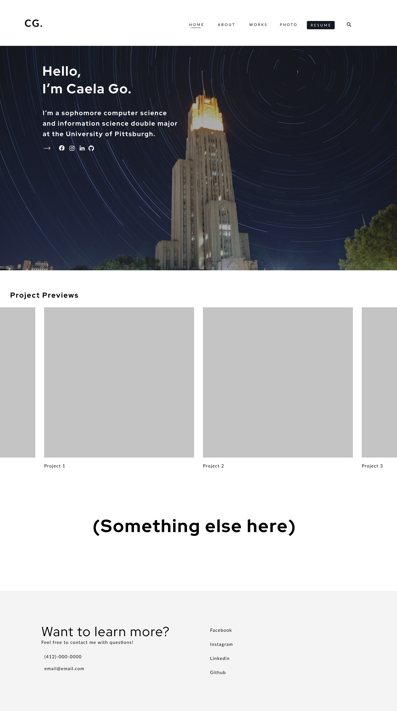

# <b>Personal Portfolio</b>

This is the repository for my website portfolio assignment in Composing Digital Media (Spring 2021). Because the rationale behind the project is to explore the affordances of web design as a medium and its ability to flexibly render content for multiple audiences, I have decided to compose a personal porfoltio to showcase more information about myself, such as projects I've completed in class, extracurriculars, and my personal hobbies. All components for the project are explained below. *For more information regarding the assignment, please refer to [assignment.md](https://github.com/cmgo412/website-portfolio-2021spring/blob/master/assignment.md).*

### Project Proposal

I've always wanted to create a personal portfolio/website to showcase some of my work, experiences, and photography for a while now, so I'm really happy I get a chance to start working on it with this project! I created a sketch in Figma of my ideas so far that I attached below, but the gist is that there'll be four main pages: home, about, works, and photo. The home page is the landing page that provides a general overview of who I am as well as previews for projects I'm particularly proud of. The about page would include a photo of myself as well as a short bio detailing my current interests, plans for the future, and anything else I find fitting. For the next two pages, I decided to divide my work into a "works" page which would contain more coding/technical work that I've completed in my classes, any personal projects, and hackathon prototypes. Likewise, the "photos" page is separate and dedicated to showcasing the various pictures I've taken so far as well as descriptions for albums.

### Preview 

For my preview, I spent most of my time browsing tutorials of JavaScript frameworks that I could potentially utilize for my project as well as looking at documenation. As such, I was only able to get a *very* simplistic barebones structure of my website, which is composed of four HTML documents: `index.html`, `about.html`, `works.html`, and `photo.html`. Each page contains links to the other pages for easy access and so that it can be styled into a navigation bar. I also created a CSS stylesheet and a JavaScript file, but kept it empty for now.

In the second preview, I decided to add some styling to the navigation bar so that I would be neatly displayed across the top of the page for all four pages. I also removed the text decoration for the links for a cleaner design. The text color is white against a blue background, which I thought provided nice contrast.

### Draft

I decided to pivot the direction of my portfolio for the draft. Because I had a particularly busy week and to save time, I decided to utilize a premade template for my webpage and limit the number of pages to one, `index.html`, where I instead separate it into the necessary sections I had planned. I spent a majority of my time looking into how the template was structured, specifically how the HTML, CSS, JavaScript, and jQuery components were interconnected so that I could appropriately modify the template to suit my needs. The main overview of the website consists of a splash page with rotating text to inform the viewer that "I'm a student, a programmer, and a photographer." I explain these details more in-depth in the section below, where I split each position into multiple paragraphs and attach a profile picture of myself. Immediately afterward, I dedicate another section to my portfolio where I showcase my projects and some of the photographs I've taken so far as a hobby. I then played around with creating a footer that would reinforce the sections above and again provide links to my social media. Because I wanted to personalize my porfolio, I also spent time designing a custom logo and favicon in Figma.

### Final Submission

For my final submission, I decided to fix any broken links that were left in the drafting stage, update my `README.md` file, and upload screenshots of my progress with the website so far.